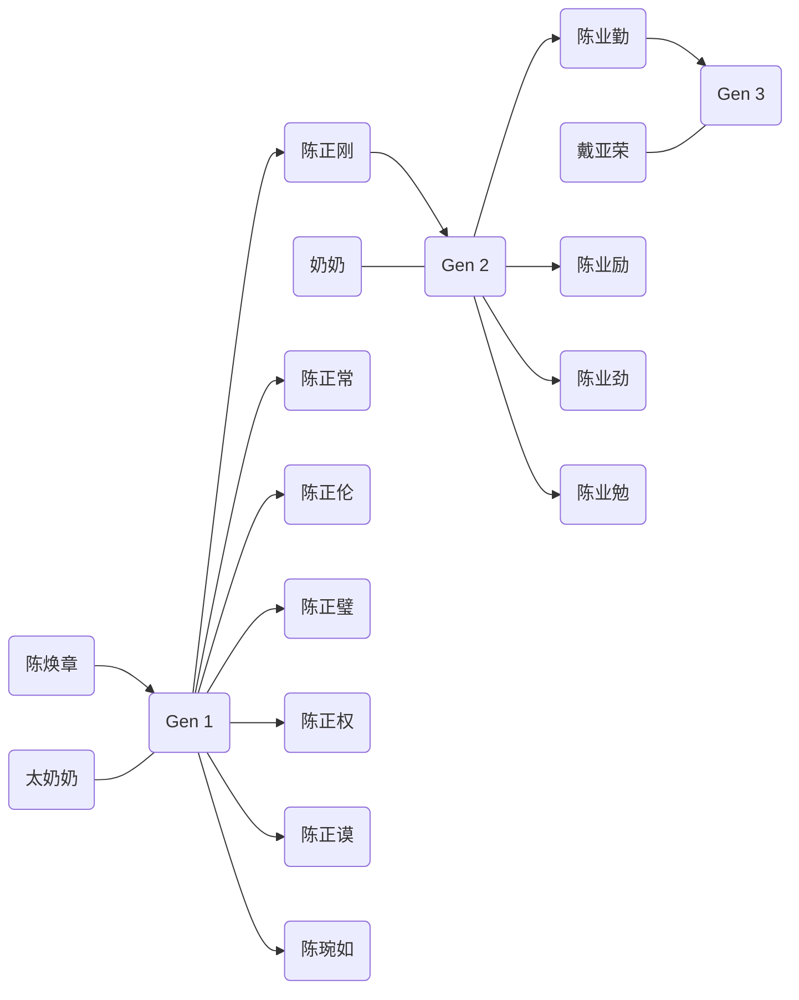

# 陈焕章

## 生平简介

陈焕章(1894-1967)，湖北洪湖新堤人，幼读私塾，及长，随父在汉口新茂元粮食行协助经营。1918年继承父业开设新茂昌粮食行，1920年改组为新茂昌协记粮食行，自任经理。他还在新堤做“疋头”生意，他开的“祥新元”疋头铺在新堤很有名气。荆州地区盛产棉花，汉口又是集散大码头，陈焕章依靠这两方面优势，把家乡的土布贩运到汉口。他艰苦创业赚了些钱，辛亥革命后就把赚到的钱带到汉口，以购买股票的形势投资了震寰纱厂、既济水电公司以及自来水公司；业务日渐发展，新茂昌协记粮食行成为汉口最大的粮商之一。他1926年被选为汉口粮业帮董，1928年当选为汉口商会委员。1932年与同乡萧纯卿、聂维周等集资在汉口开设德昌号，任经理。除经营粮食外，还经营棉花、桐油、布匹、食盐、煤油等。还投资了房地产。在民权路一带，有19栋房子收租。武汉沦陷前夕，1938年8月德昌号歇业时盈利达30余万元。同年底，避居汉口法租界，杜门谢客。伪政权派人促其参加伪治安维持会，日商以优惠条件诱其出山经商，均遭拒绝。1945年抗日战争胜利后，汉口市政府任陈为汉口商会筹备会副主任，陈于次年在汉口恢复德昌号，继续经营粮、棉。1948年又扩大投资，在汉口永康里开设慎昌号，经营粮食、桐油和棉纱，复任经理，至1949年2月结束。武汉解放后，仍在原址经营慎昌粮行，至1954年粮食统购统销时结业。陈关心家乡教育事业，1930～1948年共捐助族人所办育杰小学经费达两万余元，对汉阳县其他中小学也有捐助。武汉解放前夕，陈积极筹资，以“应变费”分送国民党政府军队，阻其撤退前的破坏活动，并参加维持武汉社会秩序，迎接解放军进城。武汉解放时，陈在商会动员各业公会捐赠大米、面粉、黄豆、木柴、煤炭等物资支援解放军部队。1949年下半年，人民政府向武汉工商界征收营业税和所得税，陈积极推动各业完成纳税入库任务。 新中国建立后，曾任武汉市工商业联合会筹备会副主任委员、武汉市各界人民代表会议协商委员会第一届、第二届委员、武汉市粮食局顾问。1967年病逝。

## 家谱

